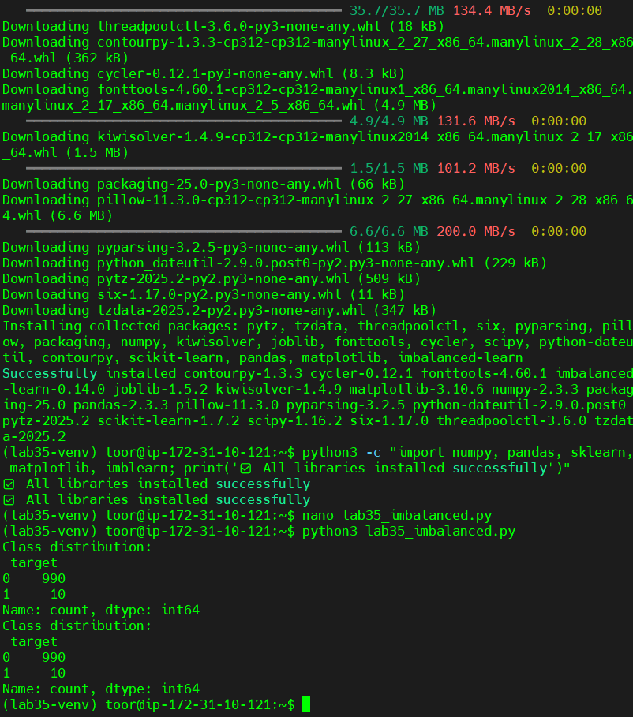
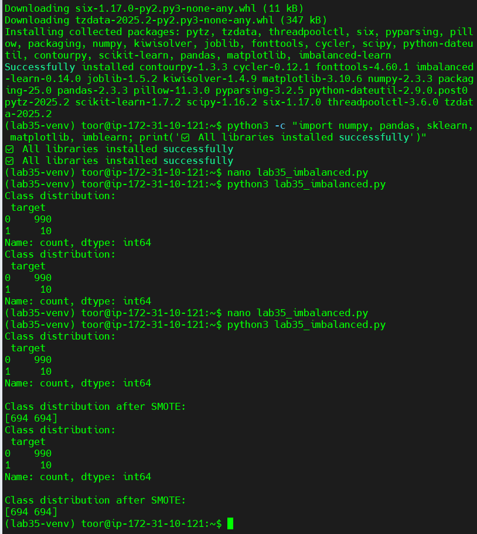
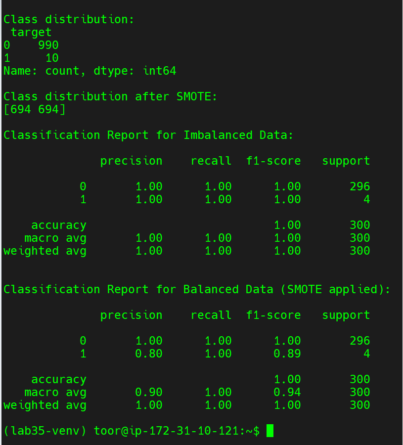

# Lab 35: Handling Imbalanced Datasets

This lab demonstrates how to handle imbalanced datasets using **SMOTE (Synthetic Minority Over-sampling Technique)**.  
We used a synthetic fraud detection dataset where the fraudulent class (1) is heavily underrepresented compared to the normal class (0).

## Key Steps:
1. **Generated a synthetic dataset** with class imbalance (990 normal vs. 10 fraud).  
2. **Checked class distribution** → confirmed imbalance.  
3. **Applied SMOTE** → balanced the dataset (694 vs. 694).  
4. **Trained Logistic Regression models** before and after balancing.  
5. **Compared performance metrics** (precision, recall, f1-score).

## Results:
- **Before SMOTE**: The model was perfect on training/testing, but this is misleading because very few fraud cases were present.  
- **After SMOTE**: The model generalized better, achieving recall of 1.0 on minority class and precision of 0.80 (improvement in robustness).

## Screenshots:
### 1. Library installation success and environment check

### 2. Dataset imbalance and SMOTE applied

### 3. Classification reports before and after balancing

## Layman's Explanation:
Imagine checking 1000 transactions for fraud, but only 10 are fraudulent. A naive model might just predict *everything as normal* and still be 99% accurate — but useless for fraud detection.  
By generating **synthetic fraud cases** (via SMOTE), we balance the dataset so the model learns what fraud looks like. This way, the model becomes more trustworthy when deployed in real life.
